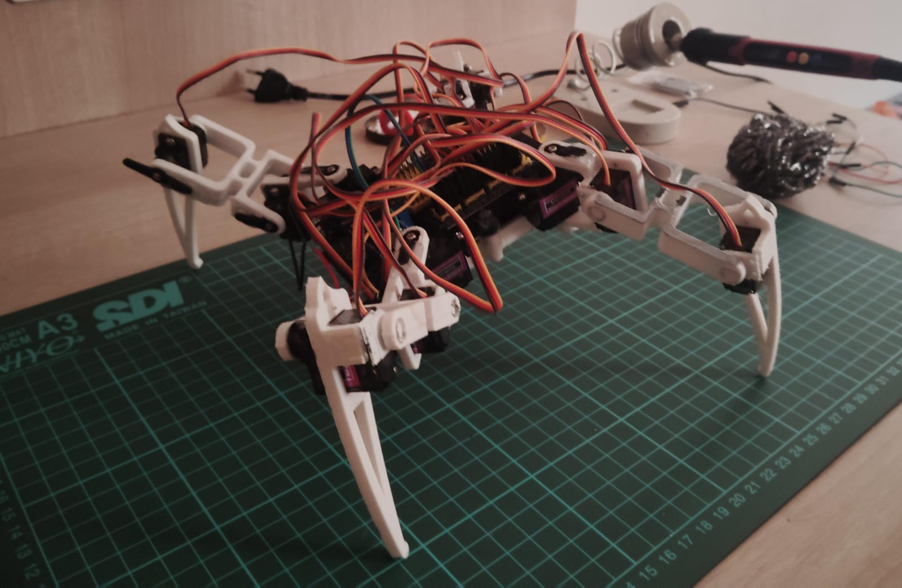
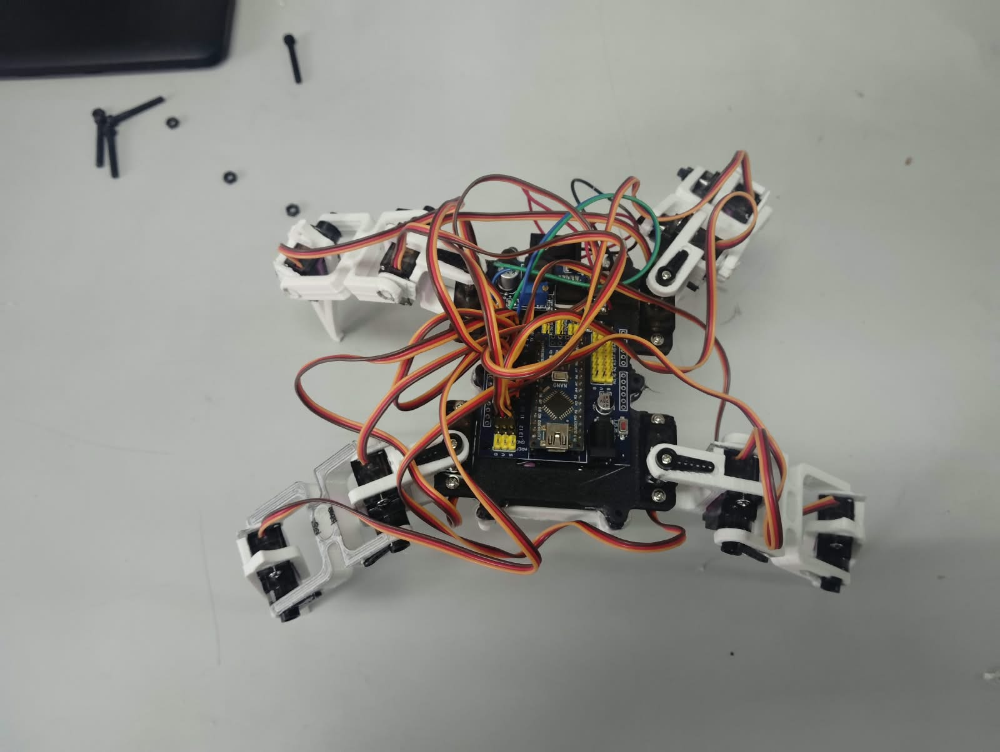

# Quadruped Robot: Rodo

<p align="center">
  
</p>

<h3 align="center">
3D-Printed Spider Robot | Arduino | Servo Control | Inverse Kinematics
</h3>

---

## Overview

This project is a 3D-printed quadruped spider robot built as a hands-on exploration of **robotics, embedded systems, servo control and inverse kinematics**.

The robot uses four multi-joint legs driven by servo motors and controlled using an Arduino. It has 12 DOF, 3 per leg.

The mechanical design, connection reference and base implementation were taken from the **RobotLk** project. I independently assembled, wired, tested and debugged the robot while studying the underlying robotics concepts, particularly **inverse kinematics** and the relationship between mathematical joint calculations and physical robot movement.

---

## Demo

<p align="center">
  
</p>

### Video Demonstration

**[▶ Watch the Robot in Action](media/rodo_video.mp4)**

Additional build photographs:

- [Close-up](media/closeup.jpeg)
- [Workstation / Build Process](media/workstation.jpeg)

---

## Key Features

- Four-legged quadruped configuration
- 3D-printed mechanical structure
- Arduino-based control
- Multi-servo leg actuation
- Coordinated leg movement
- Inverse-kinematics study
- Servo calibration and positioning
- Hands-on mechanical and electronic integration

---

## Hardware

| Component | Purpose |
|---|---|
| Arduino Nano and I/O board | Main controller and Servo driver |
| Servo motors (MG90) | Leg actuation |
| 3D-printed parts (PLA) | Body and leg structure |
| Servo horns & hardware | Mechanical linkage |
| Battery / power supply (2s Li-On + Buck)| System power |

---

## How It Works

Each leg consists of multiple servo-controlled joints. Coordinating these joints allows the foot to move through different positions and enables the complete robot to perform walking sequences.

The basic control concept is:

```text
Desired Foot Position
        ↓
Inverse Kinematics
        ↓
Joint Angles
        ↓
Servo Calibration
        ↓
Servo Commands
        ↓
Leg Movement
        ↓
Quadruped Motion
```

Rather than thinking only in terms of individual servo angles, inverse kinematics allows the desired position of the foot to be used as the starting point for calculating the required joint configuration.

---

## Inverse Kinematics

One of the main concepts I explored during this project was **Inverse Kinematics (IK)**.

For a desired foot position:

```text
P = (x, y, z)
```

the required joint angles can be calculated from the geometry of the leg.

A simplified representation is:

```text
             Foot
              ●
             /
            / L3
           /
          ●
         /
      L2/
       /
      ●
      │
     L1
      │
      ●
   Body Joint
```

The mathematical solution then has to be converted into actual servo positions while accounting for:

- Servo offsets
- Mechanical mounting
- Link dimensions
- Joint limits
- 3D-printing tolerances
- Mechanical alignment

A detailed explanation of the kinematic approach is available here:

**[Read the Inverse Kinematics Notes](docs/inverse-kinematics.md)**

---

## Electronics

The Arduino Nano acts as the main controller and sends control signals to the individual servos.

The electronics were assembled and tested as part of the physical build.

The project focuses on understanding the complete electromechanical system rather than treating the software and hardware as separate components.

---

## CAD & Source Code

The CAD files and source code used for the project are included in the repository.

### CAD

**[Download CAD Files](CAD.zip)**

The CAD package contains the files required for the 3D-printed mechanical components.

### Code

**[View Source Code](Code)**

The Arduino implementation contains the control logic used to operate the robot and its servo-driven movements.

---

## Project Structure

```text
Quadruped-Robot-Rodo/
│
├── README.md
│
├── media/
│   ├── rodo.jpeg
│   ├── closeup.jpeg
│   ├── workstation.jpeg
│   └── rodo_video.mp4
│
├── docs/
│   └── inverse-kinematics.md
│
├── CAD.zip
│
└── Code
```

---

## What I Learned

This project gave me practical experience with:

- Quadruped robot architecture
- Servo motor control
- Multi-joint coordination
- Inverse kinematics
- Mechanical assembly
- 3D-printed mechanisms
- Arduino programming
- Translating mathematical models into physical movement

The most important takeaway was understanding that robotics lies at the intersection of **mechanics, electronics, mathematics and software**.

A mathematically correct model still needs to account for the physical characteristics of the actual robot.

---

## Future Improvements

The current platform can be extended towards more advanced quadruped control.

Possible improvements include:

- Real-time inverse-kinematics control
- Parameterized gait generation
- IMU-based body stabilization
- Obstacle detection
- Wireless control
- Terrain adaptation
- Closed-loop motion control
- Autonomous walking

The long-term goal would be to move from predefined servo movements towards a system where **foot trajectories are generated mathematically and converted into coordinated leg motion in real time**.

---

## Project Status

**Completed Prototype**

The robot has been assembled, wired and tested successfully, providing a practical platform for exploring quadruped locomotion and inverse kinematics.

---

## Author

**Devanshi Maleri**

Engineering Student  
Robotics | Embedded Systems | Electronics

---
